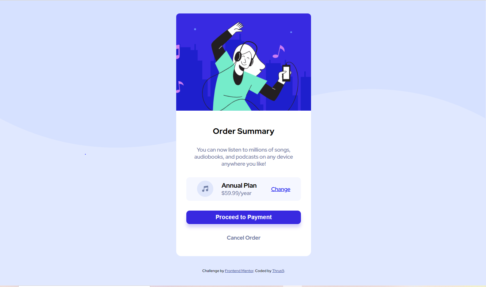

# Frontend Mentor - Order summary card solution

This is a solution to the [Order summary card challenge on Frontend Mentor](https://www.frontendmentor.io/challenges/order-summary-component-QlPmajDUj). Frontend Mentor challenges help you improve your coding skills by building realistic projects.

## Table of contents

- [Overview](#overview)
  - [The challenge](#the-challenge)
  - [Screenshot](#screenshot)
  - [Links](#links)
- [My process](#my-process)
  - [Built with](#built-with)
  - [What I learned](#what-i-learned)
  - [Continued development](#continued-development)
  - [Useful resources](#useful-resources)
- [Author](#author)

## Overview

### The challenge

Users should be able to:

- See hover states for interactive elements

### Screenshot

### Links

- Solution URL: [Add solution URL here](https://github.com/Thrush9/FEM_Order_Summary)
- Live Site URL: [Add live site URL here](https://thrush9.github.io/FEM_Order_Summary/)

## My process

### Built with

- Semantic HTML5 markup
- CSS custom properties
- Flexbox
- Mobile-first workflow

### What I learned

- Flexbox
- Background Imaging
- Image Positioning

### Continued development

- Responsiveness
- Postioning
- Colour Balance
- Alignment & Spacing

### Useful resources

- [W3Schools CSS Tutorial](https://www.w3schools.com/css/default.asp) - This helped me for most of styling.In future, I would like to do it myself rather depending upon this resources.

## Author

- Author - Thrush9
- Frontend Mentor - [@Thrush9](https://www.frontendmentor.io/profile/Thrush9)
